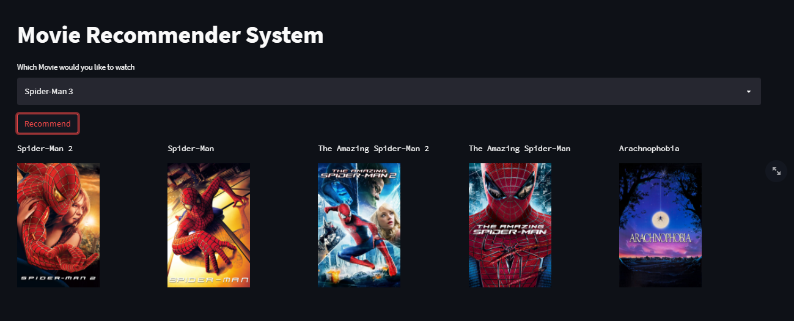

# Movie Recommendation System

### Summary
Movie Recommendation Engine developed to increase the sales of the movies based on the
user content viewed. Main recommendation Engine are three types: Content Based, Collaborative and Hybrid.
In this project, I am going to develop content based project.

### Project Goal
The Goal of my project is to increase movie sales by 15% to 20%. And to increase revenue by 5%.

### Project Aim
To increase revenue by 5%.

### Motivation

The main motivate to develop this project is to enhance my knowledge and to get internship in Data Science Position.


## Roadmap

- Taking Data

- Preprocessing Data

- Developing Recommendation Engine (Developing Model)

- Developing Website for Movie Recommendation System

- Using API to show recommendated movie images in website (Website: TMDB )

- Deploying the website in cloud ( Streamlit )


## Deployment

To deploy this project run

```bash
  download the Zip File from my Github Profile
```
```bash
  Open any editor like VS Code or, pycharm
```
```bash
  Create new Project with virtual environment
```
```bash
  Copy downloaded files in your project
```
```bash
  Then install packages (in terminal type): pip install streamlit
```
```bash
   Install Pickle packages if error shown (in terminal type): pip install pickle
```
```bash
  To run project (in terminal type) : streamlit run app.py 
```
## Tech Stack

**Client:** Machine Learning, Python, Statistics

**Server:** Streamlit


## Screenshots



## Demo

App Demo in local host


## Authors

- [@dipeshadhikarioffical](https://www.github.com/dipeshadhikarioffical)


## 🛠 Skills
Python, Machine Learning, Statistics, Excel, Data Analysis, Time Series, SQL, Flask, Streamlit, Git


## 🔗 Links

[](https://www.linkedin.com/in/dipeshadhikarioffical/)
[](https://twitter.com/dipeshadhikarioffical)
